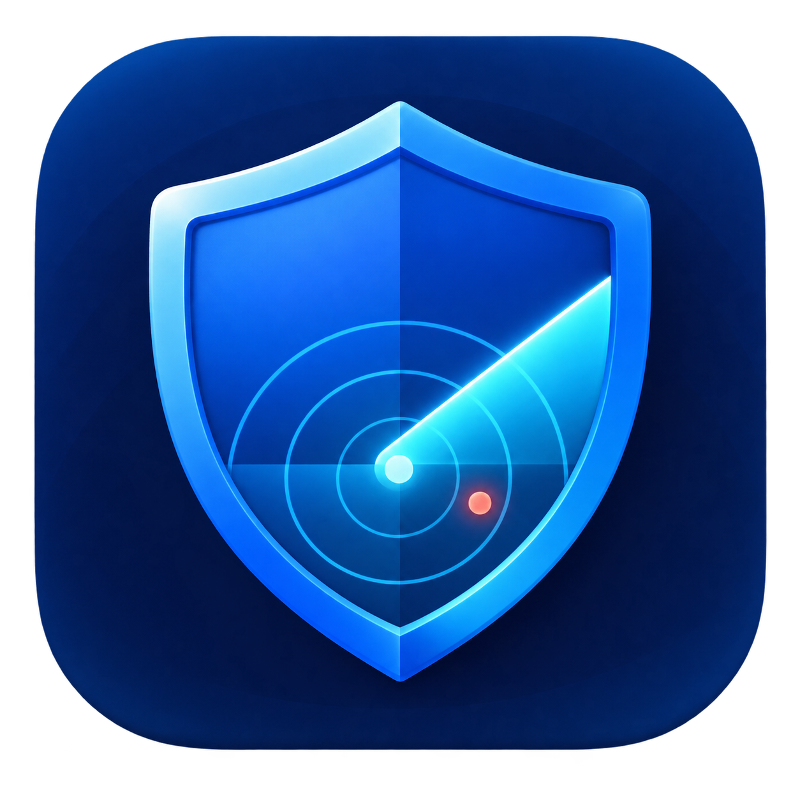
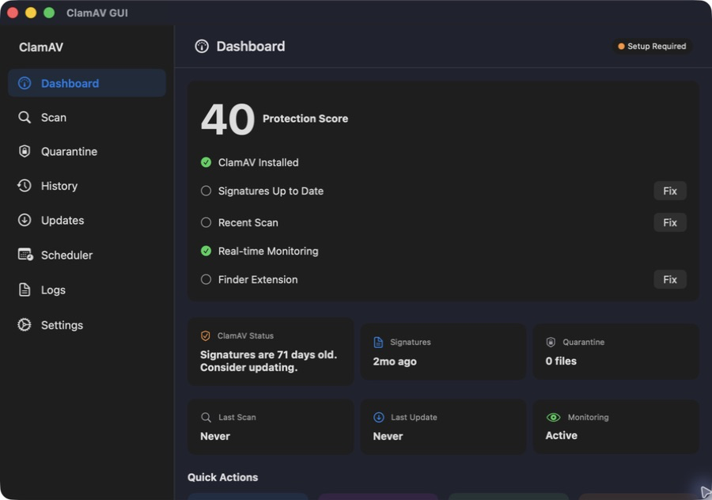

<p align="center">
  
</p>

<h1 align="center">SafeMac AV</h1>

<p align="center"><strong>Scan locally. Stay in control.</strong></p>

<p align="center">
  <a href="https://github.com/newtonlorenz/safemac-av/actions/workflows/ci.yml"></a>
  <a href="https://github.com/newtonlorenz/safemac-av/releases/latest"></a>
  <a href="https://support.apple.com/macos"></a>
  <a href="LICENSE"></a>
</p>

**Free, private malware scanning and monitoring for macOS. Powered by [ClamAV](https://www.clamav.net/).**

SafeMac AV turns ClamAV's command-line engine into a complete local malware-scanning workflow. Scan on demand, watch folders, update signatures, quarantine detections, and schedule repeat checks. Review history and start scans from Finder. There are no subscriptions, telemetry, or cloud uploads.

**[Download the latest signed and notarized release →](https://github.com/newtonlorenz/safemac-av/releases/latest)** *(v1.0.0 uses the previous ClamAV GUI package name; v1.1.0 and later use SafeMac AV)*



> [!IMPORTANT]
> This project is an independent community app. It is not affiliated with, endorsed by, or supported by Cisco, Talos, or the ClamAV project. ClamAV is installed separately and remains the scanning engine.

## More than a scan button

- **Scan on demand.** Run quick scans, choose any file or folder, or start from Finder.
- **Watch important folders.** Monitor selected locations and automatically scan new downloads while the app runs.
- **Respond to detections.** Review findings, quarantine suspicious files, verify restores, and confirm permanent deletion.
- **Automate routine checks.** Schedule daily, weekly, or monthly scans and keep signatures current with `freshclam`.
- **Work from the menu bar.** Check protection, scan, update signatures, reopen the app, or quit even after closing the main window.
- **Start protection with your Mac.** Enable SafeMac AV as a login item from Settings, with its current macOS approval status shown in the app.
- **Receive local alerts.** Get scan, detection, signature-update, and scheduled-scan notifications, with optional clean-download notices.
- **Stay in control.** Configure exclusions and limits, inspect history and logs, and pause, resume, or cancel scans.
- **Use your preferred engine mode.** Run `clamscan` directly or connect to an optional local `clamdscan` service.

Everything the app stores stays on your Mac. There are no analytics or telemetry SDKs. `freshclam` only contacts ClamAV's infrastructure when you request a signature update.

## Requirements

- macOS 13 Ventura or later
- Xcode with the macOS SDK for source builds
- [Homebrew](https://brew.sh/) and its [`clamav` formula](https://formulae.brew.sh/formula/clamav.html), or an equivalent local ClamAV installation

Both Apple silicon (`/opt/homebrew`) and Intel Homebrew (`/usr/local`) defaults are supported. Custom executable and data paths can be set in the app.

## Releases

Download the latest compiled build from [GitHub Releases](https://github.com/newtonlorenz/safemac-av/releases/latest).

> [!NOTE]
> v1.0.0 predates the SafeMac AV rename and is distributed as `ClamAV-GUI-1.0.0.dmg` containing `ClamAV-GUI.app`. Releases from v1.1.0 use a `SafeMac-AV` DMG containing `SafeMac AV.app`.

Each release provides:

- a Developer ID-signed and Apple-notarized DMG
- universal binaries for Apple silicon (`arm64`) and Intel (`x86_64`)
- a `SHA256SUMS.txt` checksum file
- source archives generated by GitHub

The app requires macOS 13 Ventura or later. Install ClamAV separately before launching it:

```bash
brew install clamav
```

Download the DMG and checksum file into the same folder. Verify the download:

```bash
shasum -a 256 -c SHA256SUMS.txt
```

Open the DMG and drag the included app into `Applications`. It is named `ClamAV-GUI` in v1.0.0 and `SafeMac AV` from v1.1.0.

When upgrading from an older ClamAV GUI build, launch SafeMac AV and re-save any enabled schedules so their LaunchAgents point to the renamed app. Remove the old app after confirming the new build works.

## Quick start

1. Install ClamAV:

   ```bash
   brew install clamav
   ```

2. Create an active `freshclam` configuration from Homebrew's sample, then comment out or remove the standalone `Example` line:

   ```bash
   BREW_PREFIX="$(brew --prefix)"
   cp -n "$BREW_PREFIX/etc/clamav/freshclam.conf.sample" \
     "$BREW_PREFIX/etc/clamav/freshclam.conf"
   ${EDITOR:-vi} "$BREW_PREFIX/etc/clamav/freshclam.conf"
   "$BREW_PREFIX/bin/freshclam"
   ```

   If `freshclam.conf` already exists, keep it and verify that `Example` is commented. ClamAV's [signature management guide](https://docs.clamav.net/manual/Usage/SignatureManagement.html) explains the configuration and update process.

3. Clone and open the project:

   ```bash
   git clone https://github.com/newtonlorenz/safemac-av.git
   cd safemac-av
   open ClamAV-GUI.xcodeproj
   ```

4. Select the `ClamAV-GUI` scheme and run it. The Settings screen can auto-detect Homebrew paths; update signatures before the first scan.

SafeMac AV remains available from its shield in the menu bar after the main window closes. Settings can optionally hide the Dock icon; this is reversible from **Settings → Menu Bar & Dock**, and the full window remains available from the menu bar.

For a guided environment check, run `./setup.sh`. It is read-only by default; installation and configuration changes require explicit flags shown by `./setup.sh --help`.

## Build and test

Build from the command line without a signing identity:

```bash
xcodebuild \
  -project ClamAV-GUI.xcodeproj \
  -scheme ClamAV-GUI \
  -configuration Debug \
  -destination 'platform=macOS' \
  CODE_SIGNING_ALLOWED=NO \
  build
```

Run the unit and integration suite:

```bash
xcodebuild \
  -project ClamAV-GUI.xcodeproj \
  -scheme ClamAV-GUI \
  -destination 'platform=macOS' \
  CODE_SIGNING_ALLOWED=NO \
  test
```

Run the interactive UI smoke test on a logged-in Mac. Unlike the headless unit suite, the UI runner needs a locally signable test host, so do not disable code signing for this command:

```bash
xcodebuild \
  -project ClamAV-GUI.xcodeproj \
  -scheme ClamAV-GUI-UI \
  -destination 'platform=macOS' \
  test
```

The hosted CI workflow intentionally omits UI automation because macOS UI tests require both a locally signable test host and a reliable logged-in window session. An ad-hoc or development-signed local test run is sufficient; forcing `CODE_SIGNING_ALLOWED=NO` terminates the UI runner before the test can execute.

## Local packages and releases

The distribution helper creates `build/SafeMac-AV.dmg` in three explicit modes:

```bash
# Unsigned local DMG for testing
./scripts/create-dmg.sh

# Signed local DMG; not notarized
SIGNING_IDENTITY='Developer ID Application: Your Name (TEAMID)' \
  ./scripts/create-dmg.sh

# Signed, submitted with a notarytool Keychain profile, and stapled
SIGNING_IDENTITY='Developer ID Application: Your Name (TEAMID)' \
NOTARY_PROFILE='safemac-av-notary' \
  ./scripts/create-dmg.sh

# Signed, submitted with an App Store Connect API key, and stapled
SIGNING_IDENTITY='Developer ID Application: Your Name (TEAMID)' \
NOTARY_KEY_PATH='/path/to/AuthKey_ABC123DEFG.p8' \
NOTARY_KEY_ID='ABC123DEFG' \
NOTARY_ISSUER_ID='00000000-0000-0000-0000-000000000000' \
  ./scripts/create-dmg.sh
```

Create the Keychain profile separately with `xcrun notarytool store-credentials`. Credentials should stay in Keychain or in an external `.p8` file outside the repository and must never be committed or passed as plain-text script arguments. The resulting DMG and `SHA256SUMS.txt` are written under the ignored `build/` directory. Only the notarization modes submit to Apple; they staple both the app bundle and DMG and verify nested embedded code before publication.
If Keychain contains duplicate Developer ID certificate names, set `SIGNING_IDENTITY` to the SHA-1 hash shown by `security find-identity -v -p codesigning`.

Maintainers can also run the manual **Release package** GitHub Actions workflow to build a signed, notarized, stapled app-in-DMG package and checksum file without publishing a GitHub Release. Configure a protected GitHub environment named `release` with required maintainer reviewers, and store the release secrets in that environment. Add a GitHub tag ruleset for `refs/tags/v*` that blocks updates and deletions and limits tag creation to designated release maintainers. The workflow job runs only when dispatched from `main`; its `release_ref` must be a full annotated tag ref such as `refs/tags/v1.2.0`, and the resolved tag commit must equal the freshly fetched current `origin/main` HEAD. The workflow resolves and compares the tag before exposing any release secret, then checks out the immutable commit SHA. It requires these secrets:

- `DEVELOPER_ID_CERTIFICATE_BASE64`: base64-encoded Developer ID Application `.p12`
- `DEVELOPER_ID_CERTIFICATE_PASSWORD`: password for that `.p12`
- `RELEASE_KEYCHAIN_PASSWORD`: temporary CI keychain password
- `NOTARY_KEY_BASE64`: base64-encoded App Store Connect API `.p8`
- `NOTARY_KEY_ID`: App Store Connect API key ID
- `NOTARY_ISSUER_ID`: App Store Connect issuer ID
- `SPARKLE_PRIVATE_ED_KEY_BASE64`: base64 encoding of the modern private-key file exported by Sparkle `generate_keys -x` (the exported file must decode to a 32-byte Ed25519 seed)

Set repository variables `SPARKLE_FEED_URL`, `SPARKLE_PUBLIC_ED_KEY`, and `SPARKLE_DOWNLOAD_URL_PREFIX` to embed app-update configuration in release builds and generate appcasts with published DMG URLs. Both URLs must be credential-free HTTPS URLs, the download prefix must end in `/`, and the public key must be canonical base64 for exactly 32 bytes. Before tagging, maintainers can run `./scripts/verify-github-release-controls.sh` to confirm the protected `release` environment, required release secrets, Sparkle variables, and immutable `refs/tags/v*` ruleset are present. Before importing the Developer ID certificate, the release workflow decodes the private-key file under the runner's temporary directory with mode `0600`, derives its public key, and rejects any public/private mismatch. The temporary key is removed even if a later step fails. If the feed URL or public key is missing from a non-release local build, SafeMac AV disables its app-update UI instead of checking a placeholder feed. Generate a local appcast from a directory containing release archives with:

```bash
SPARKLE_PRIVATE_ED_KEY='/path/to/sparkle_private_ed_key' \
SPARKLE_DOWNLOAD_URL_PREFIX='https://example.com/downloads/' \
  ./scripts/generate-appcast.sh build/appcast
```

Before replacing the currently installed app, verify that the signed appcast advertises exactly one newer update to that installed build. Both canary scripts require a deep, strict Developer ID Application signature from Team `CQPH8YR62A`, hardened runtime, secure timestamp, and Gatekeeper trust:

```bash
./scripts/verify-installed-sparkle-canary.sh "/Applications/SafeMac AV.app" build/appcast/appcast.xml build/SafeMac-AV.dmg
```

After publishing the appcast and DMG, run the installed-app Sparkle canary against a temporary copy of the installed app. The canary requires Sparkle 2's `sparkle-cli`; it does not mutate the source app bundle:

```bash
SAFEMAC_CANARY_EXPECT_UPDATE=1 \
SAFEMAC_CANARY_INSTALL=1 \
SPARKLE_CLI='/path/to/sparkle.app/Contents/MacOS/sparkle' \
  ./scripts/run-installed-sparkle-canary.sh
```

Release publication remains a separate, explicit step after downloading and verifying the workflow artifacts.
See [docs/RELEASE_CHECKLIST.md](docs/RELEASE_CHECKLIST.md) for the full release gate.

## Security and privacy model

SafeMac AV launches executables at the paths configured in Settings and passes selected local paths as process arguments. It does not upload files, scan results, or usage data. A local `clamdscan` backend is supported; remote TCP `clamd` is not configured by this app.

The app sandbox is deliberately disabled. Scanning arbitrary user-selected folders, observing configured folders with FSEvents, writing a user-selected quarantine location, installing per-user LaunchAgents, and coordinating with Finder all require filesystem/process access that the current design cannot provide from the App Sandbox. Review source builds before running them, and only configure trusted ClamAV executable paths.

Local state can contain sensitive path names and threat results:

- Settings and scheduled-job metadata: `~/Library/Application Support/ClamAV-GUI/`
- Per-user schedules: `~/Library/LaunchAgents/com.newtonlorenz.ClamAV-GUI.scan.*.plist`
- Automatic malware-signature schedule: `~/Library/LaunchAgents/com.newtonlorenz.ClamAV-GUI.signature-update.plist`
- Quarantine by default: `~/.clamav-quarantine/`
- Logs and scan history: held in application memory for the current run

Local notifications deliberately omit file names, full paths, threat signatures, schedule names, and raw update errors. Open SafeMac AV to review those details. Notification permission and preferences, including threat sounds and clean-download alerts, are controlled in Settings; clean-download alerts are off by default.

The existing `ClamAV-GUI` support paths, scheduled-job metadata and labels, bundle identifiers, target, and scheme remain unchanged for compatibility with installed settings, Finder integration, and existing build automation.

See [SECURITY.md](SECURITY.md) for the supported reporting process.

## Current limitations

- This is a user-facing ClamAV client, not a replacement for endpoint security or macOS platform protections.
- Folder monitoring is application-level FSEvents monitoring. It only runs while SafeMac AV is running and is not a kernel or system on-access scanner.
- Scheduled scans are per-user `launchd` jobs. The app must remain at the path captured by the job, and the user must be logged in.
- Automatic signature updates are a separate per-user `launchd` job that runs the configured local `freshclam`. They do not update the SafeMac AV app or the externally managed Homebrew ClamAV engine. Opening an installed build reconciles the job to that app's current executable path.
- The Finder extension must be signed with the app, use the same unprovisioned Team-ID app group (`CQPH8YR62A.com.newtonlorenz.ClamAV-GUI` upstream), and be enabled manually in System Settings. Opening or reopening the app drains the shared queue; the distributed notification is only a best-effort accelerator because macOS can suppress it from a sandboxed extension. The handoff fails closed if that shared container is unavailable. Forks must replace the Team ID and namespaced identifiers together.
- Launch at login uses the macOS 13+ Login Items service. macOS may require the user to approve SafeMac AV in System Settings before it can open automatically.
- Source builds are unsigned unless you configure an Apple Developer identity. A successful local build is not the same as a signed and notarized distribution.

## Project layout

```text
ClamAV-GUI/          SwiftUI app, models, and local service layer
ClamAV-GUI-Finder/   Finder Sync extension
ClamAV-GUITests/     Unit and integration tests
ClamAV-GUIUITests/   Interactive macOS UI smoke tests
docs/                Architecture and maintainer notes
scripts/             Icon and distribution helpers
```

The runtime design and state boundaries are documented in [docs/ARCHITECTURE.md](docs/ARCHITECTURE.md).

## Contributing

Bug reports, focused fixes, tests, and accessibility improvements are welcome. Start with [CONTRIBUTING.md](CONTRIBUTING.md) and follow the [Code of Conduct](CODE_OF_CONDUCT.md).

The checked-in `com.newtonlorenz.*` identifiers identify the upstream project. If you distribute a fork, change the app, extension, test, notification, LaunchAgent, and app-group identifiers to a namespace you control; see the fork checklist in the contributing guide.

## License and credit

SafeMac AV is available under the [MIT License](LICENSE). You may use, modify, and distribute it, including commercially. The license requires copies or substantial portions to retain the copyright and permission notice:

```text
Copyright (c) 2026 Daniel Graetzer and Newton Lorenz
```

That retained notice is the required credit. A visible acknowledgement in your product or documentation is appreciated, but the MIT License does not require additional advertising.

SafeMac AV was originally developed by **Daniel Graetzer** for **Newton Lorenz**. See [AUTHORS.md](AUTHORS.md) for project credits.

ClamAV itself is a separate project under its own license and trademarks.
